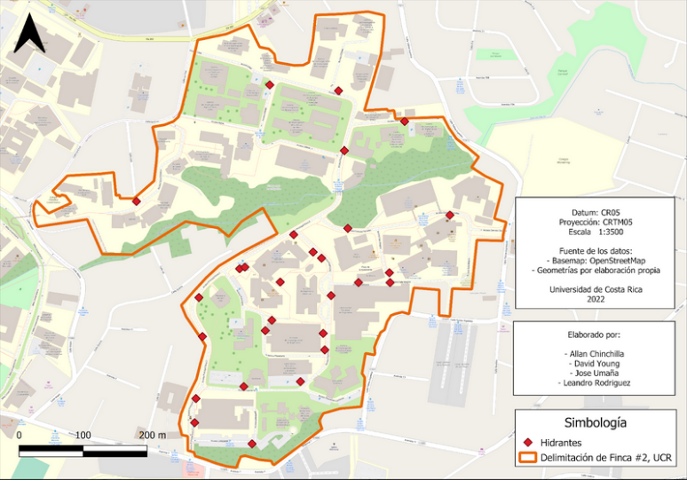
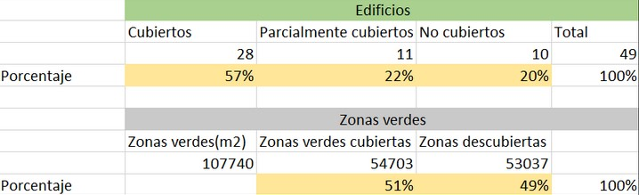
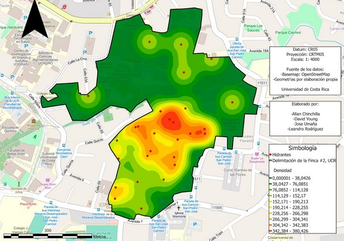

# Disponibilidad de hirantes en la ciudad de la investigación en la Universidad de Costa Rica

*La información contenida en esta página web está elaborada con información de un trabajo previo realizado por los colegas Leandro Rodriguez, Jose Umaña, Allan Chinchilla y David Young para el curso de Cartografía Multivariada y Geovisualización.*

Durante el primer semestre de 2022, se realizó un levantamiento de información sobre la disponibilidad de hidrantes en **la finca #2 de la Universidad de Costa Rica**, esto con el objetivo de conocer los edificios que estaban poco cubiertos en caso de un incendio.

### Metodología

Para la recolección de datos, se hizo trabajo de campo a lo largo de la finca #2 de la Universidad de Costa Rica para conocer mediante observación, la ubicación exacta de estos, con el fin de generar un geovisualizador web.

Además, el procesamiento de los datos recolectados en campo se hizo mediante un software SIG, con el fin de generar las cartografías necesarias y finales, adeás para crear los polígonos de los edificios, dentro de este software la exportación a la web se hizo mediante un complemento o plugin. Por último se utilizó un sistema de control de versiones para subir los archivos exportados por el complemento mencionado y poder generarlo en formato página web.

Un listado de los software utilizados se muestra en la siguiente lista:

- Qfield: Para levantar la información de los hidrantes del campo.
- QGIS: Dentro de él se utilizó el complemento de Qgis2web
- GitHub

### Principales resultados.

Figura #1

 En este ejercicio se obtuvieron un total de 28 hidrantes identificados (Figura 1), donde se observa que la mayoría de los hidrantes se encuentran distribuidos a los **alrededores de la parte sur y sureste de la Ciudad de la investigación**, lo cual abarca los edificios de la Facultad de Ciencias Sociales, la Facultad de Ingeniería y el edificio de LANAMME (Laboratorio Nacional de Materiales y Modelos Estructurales).

De los hidrantes mapeados, todos son del tipo de columna húmeda, con tres salidas (una de 4 ½ pulgadas y dos de 2 pulgadas). Con respecto a las marcas, del total de hidrantes 16 de ellos son marca Clow, 5 de la marca Jones y se presenta el caso de 7 hidrantes en los cuales no se especifica su marca. Además, 15 de los hidrantes identificados presentaron corrosión en alguna de sus partes visibles.
     
Los detalles anteriormente mencionados se pueden observar mediante un geovizualizador web [visitar en este link](https://david-young99.github.io/Hidrantesv2/) en donde se pueden contemplar las características presentadas en el formulario para cada uno de los hidrantes. En donde también permite mostrar el radio de cada uno de ellos dentro de su distribución espacial, en donde se obtuvo que el porcentaje de edificios cubiertos en la zona de alcance por los hidrantes corresponde a un 57%, y las zonas verdes en un 51% (ver Figura 2).

Figura #2

 En la figura 3, se observa la distribución, así como la concentración espacial de los hidrantes en la Ciudad de la Investigación, se observa como mayoritariamente los hidrantes se encuentran de forma concentrada entre los edificios de Ingeniería y Ciencias Sociales. 
 
 
 
 
 Figura #3
 
 Se puede encontrar un poco más de información sobre los criterios con los que se basaron los radios del mapa en el siguiente [enlace](http://www.pgrweb.go.cr/DOCS/NORMAS/1/VIGENTE/R/2010-2019/2010-2014/2010/10A7F/D0EDD.HTML), sobre la declaratoria del servicio de hidrantes como servicio público y la reforma de leyes conexas del 11 de junio del 2008.
 
## Referencias
Alfaro-Sánchez, M., Romero-Vargas, M., & Bermúdez-Rojas, T. (2018). Indicadores de Proximidad a Servicios Urbanos en la Ciudad de Heredia Indicators of Proximity to Urban Services in Heredia City, Costa Rica. Revista Geográfica, (61). https://www.revistas.una.ac.cr/index.php/geografica/article/download/10684/13266?inlin
de la Vega, G. (2016). El uso de los Sistemas de Información Geográfica para la “geoprevención” en el Servicio de Bomberos del Ayuntamiento de Santander. Universidad de Cantabria. https://n9.cl/4k5cr
Ley N°8641, Declaratoria del servicio de hidrantes como servicio público y reforma de leyes conexas. (11 de junio del 2008). Asamblea Legislativa de la República de Costa Rica. http://www.pgrweb.go.cr/DOCS/NORMAS/1/VIGENTE/R/2010-2019/2010-2014/2010/10A7F/D0EDD.HTML
Lizano, M., & Masís, R. (2022). Implementación de tecnologías geoespaciales en la ciudad universitaria Rodrigo Facio de la Universidad de Costa Rica como insumos para el ordenamiento territorial del campus. Entorno Geográfico, 24, 1–27. https://doi.org/10.25100/eg.v0i24.11905

Ramírez-Zúñiga, J. (2016). Diseño de un sistema de distribución de agua para la instalación de hidrantes en la sede central del Instituto Tecnológico de Costa Rica. Tecnológico de Costa Rica. https://n9.cl/poatq
Salazar, S., & Idárraga, J. (2017). Análisis espacial de cobertura de hidrantes de la Ciudadela del Norte, mediante uso de SIG (TFG). Universidad de Manizales. https://n9.cl/zuyxh

